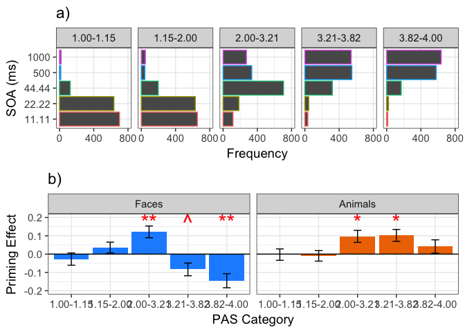
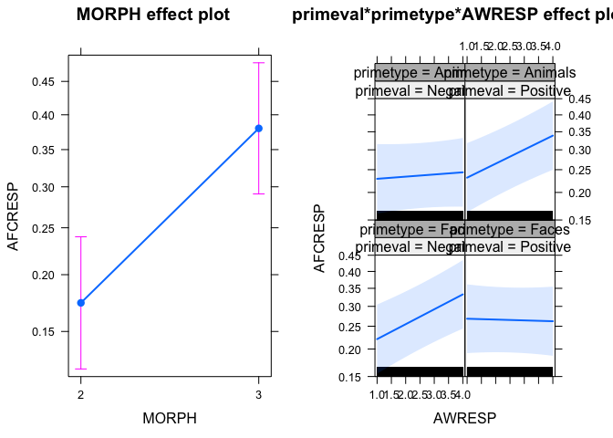

| Section | Description | Status |
| --- | --- | --- |
| [Data Cleaning](#clean) | Data Summary and Cleaning | **Complete** |
| [Observer Awareness](#aware) | Summarising observer awareness of the primes | **Complete** |
| [Morph maniplation check](#morph) | Checking the effect of morph level | **Complete** |
| [Association with Awareness](#prime) | Analysis of priming effects | **Complete** |
| [Model comparison](#models) | Classification accuracy and leave one out analysis| **Ongoing** |


***
<a id='clean'></a>
## Data cleaning

Set the working directory and import libraries.


```r
library(ggplot2)
```

```
## Warning: package 'ggplot2' was built under R version 3.2.5
```

```r
library(reshape2)
```

```
## Warning: package 'reshape2' was built under R version 3.2.5
```

```r
library(multcomp)
```

```
## Warning: package 'multcomp' was built under R version 3.2.5
```

```
## Loading required package: mvtnorm
```

```
## Warning: package 'mvtnorm' was built under R version 3.2.5
```

```
## Loading required package: survival
```

```
## Warning: package 'survival' was built under R version 3.2.5
```

```
## Loading required package: TH.data
```

```
## Warning: package 'TH.data' was built under R version 3.2.5
```

```
## Loading required package: MASS
```

```
## 
## Attaching package: 'TH.data'
```

```
## The following object is masked from 'package:MASS':
## 
##     geyser
```

```r
library(phia)
```

```
## Loading required package: car
```

```
## Warning: package 'car' was built under R version 3.2.5
```

```r
library(psyphy)
library(modelfree)
```

```
## Loading required package: PolynomF
```

```
## Warning: package 'PolynomF' was built under R version 3.2.5
```

```
## Loading required package: SparseM
```

```
## Warning: package 'SparseM' was built under R version 3.2.5
```

```
## 
## Attaching package: 'SparseM'
```

```
## The following object is masked from 'package:base':
## 
##     backsolve
```

```r
library(drc)
```

```
## Warning: package 'drc' was built under R version 3.2.5
```

```
## 
## 'drc' has been loaded.
```

```
## Please cite R and 'drc' if used for a publication,
```

```
## for references type 'citation()' and 'citation('drc')'.
```

```
## 
## Attaching package: 'drc'
```

```
## The following objects are masked from 'package:stats':
## 
##     gaussian, getInitial
```

```r
library(plotrix)
```

```
## Warning: package 'plotrix' was built under R version 3.2.5
```

```r
setwd("/Users/nickhedger/Documents/Priming")
```

Read in the individual subject data in a loop into a single dataframe.


```r
filevec=list.files(pattern="_datafile.txt")

# 3) Loop through the files and put them into a single dataframe -------------

p1=data.frame()
for (i in 1:length(filevec)){

p1=rbind(read.table(file=filevec[i], header = FALSE,blank.lines.skip=FALSE,sep=",",fill=TRUE),p1)
}
```

Assign column names.


```r
colnames(p1)=c("trial","primetype",'primeval','targem','targmorphstrength','SOA','model','ELAPSED','AFCRESP','AFCRT','AFCRESP2','AWRESP','MORPH')
```

Set factors.


```r
p1$Participant=rep(1:length(filevec),each=800)
p1$correct=ifelse(p1$primetype!=p1$AFCRESP2,1,0)
# Here I make SOA both categorical(SOA) and continuous(SOAn).
p1$SOAn=p1$SOA
p1$SOA=factor(p1$SOA)
p1$primetype=factor(p1$primetype,levels=c(1,2),labels=c("Faces","Animals"))
p1$AFCRESP=factor(p1$AFCRESP,levels=c(1,2),labels=c("Angry","Happy"))
p1$primeval=factor(p1$primeval,levels=c(1,2),labels=c("Negative","Positive"))
p1$Participant=factor(p1$Participant)
p1$model=factor(p1$model)
p1$MORPH=factor(p1$MORPH)

head(p1)
```

```
##   trial primetype primeval targem targmorphstrength   SOA model  ELAPSED
## 1     1     Faces Positive      2                 2 22.22     9 0.022264
## 2     2   Animals Positive      1                 1 11.11    10 0.011141
## 3     3   Animals Negative      1                 1 22.22     2 0.022251
## 4     4     Faces Negative      2                 1 22.22    10 0.022235
## 5     5   Animals Positive      2                 2 22.22     7 0.022293
## 6     6   Animals Positive      1                 1  1000     1 1.001000
##   AFCRESP  AFCRT AFCRESP2 AWRESP MORPH Participant correct    SOAn
## 1   Happy 2.3448        2 1.0188     4           1       1   22.22
## 2   Angry 1.9429        1 1.7887     1           1       1   11.11
## 3   Angry 2.0462        2 1.0188     1           1       0   22.22
## 4   Angry 7.3720        1 1.0423     3           1       0   22.22
## 5   Happy 1.4626        2 1.0610     4           1       0   22.22
## 6   Angry 4.0997        1 3.9671     1           1       1 1000.00
```


Variables are as follows: 

1. Trial Number (1-560)
2. Prtime Type (faces, animals) 
3. Prime Valence - (positive, negative)
4. Target Emotion (happy, angry)
5. Target morph strength (weak, strong)
6. SOA - the SOA between prime and mask
7. model - the stimulus number used
8. Elapsed - actual time elapsed
9. AFCRESP - the response to the target stimulus (happy or angry?)
10. AFCRT - the RT to the target stimulus
11. AFCRESP2 - The 2AFC response to whether or not the prime was a face or an animal
12. AWRESP - The visibility of the stimulus.
13. MORPH - The morph level (essentially 4 and 5 combined into one continuous variable)
14. Participant
15. Correct - Whether or not they correctly identified the prime type (i.e. if AFCRESP2 = prime type)

***

<a id='aware'></a>
## Observer awareness of primes

Plot the PAS scores as a function of SOA. This is now changed so that SOA is on a log scale instead. I also don't bother with plotting individual subject data since it makes the plot quite noisy.


```r
tapply(p1$correct,list(p1$Participant,p1$SOA),mean)
```

```
##      11.11   22.22   44.44     500    1000
## 1  0.51875 0.45625 0.61875 0.58750 0.58750
## 2  0.51875 0.55000 0.91250 0.96875 0.92500
## 3  0.53750 0.56250 0.98750 1.00000 0.99375
## 4  0.46875 0.48125 0.85000 0.98125 0.98750
## 5  0.50000 0.56875 0.96875 0.99375 0.98750
## 6  0.60000 0.54375 0.90000 0.95000 0.98750
## 7  0.49375 0.58750 0.93125 0.98125 0.96250
## 8  0.49375 0.54375 0.96875 0.98125 0.98750
## 9  0.53750 0.51250 0.80000 0.96250 0.93125
## 10 0.46250 0.54375 0.95000 0.93750 0.94375
## 11 0.45000 0.52500 0.95000 1.00000 0.99375
## 12 0.52500 0.59375 0.96875 0.98750 0.99375
## 13 0.50625 0.53125 0.86875 0.90625 0.89375
## 14 0.46250 0.62500 0.94375 0.98750 1.00000
## 15 0.49375 0.52500 0.74375 0.95625 0.99375
## 16 0.48125 0.61250 0.96250 1.00000 0.99375
## 17 0.51250 0.48125 0.83750 0.96875 0.97500
## 18 0.53750 0.48750 0.96875 0.97500 0.98125
## 19 0.46875 0.55000 0.88750 0.98125 0.96250
## 20 0.50625 0.51875 0.95625 0.99375 0.98750
```

Participant 1 has very low performance in the 2AFC check. He never exceeds 59%, even at an SOA of 1000 ms. I'll consider this absurd and get rid of him.


```r
# Remove participant 1 and re-level the factor.
p1=p1[p1$Participant!=1,]
p1$Participant=factor(p1$Participant)
levels(p1$Participant)=rank(as.numeric(levels(p1$Participant)))

# Start plot object that I will add line to.
P1=ggplot(p1, aes(SOAn, AWRESP),group=Participant)+geom_rect(xmin=0,xmax=1000,ymin=1,ymax=2,fill="gray90",alpha=.2) +scale_y_continuous(limits=c(1,4),breaks=seq(1,4,1))+ylab("PAS score")+xlab("SOA (ms)")+facet_wrap(primetype~primeval)+ theme(legend.position="none")+theme_bw(base_size=14)+ theme(legend.position="none")+ggtitle("a)")
p1b=P1+scale_x_log10()+ annotation_logticks(sides = "b") +geom_jitter(colour="dodgerblue1",size=1,alpha=0.2,width=0.05)
```

Now fit a cumulative normal to each condition. I'm not going to plot individual curves for each observer because this will clutter the plot. Instead I will plot the detection threshold (estimated from a PAS score of 2.5).


```r
# Define a range of values for predicting from the regression line
xseq=seq(11,1000,len=1000)
range01 <- function(x){(x-min(x))/(max(x)-min(x))}

# We need the curves to be in a dataframe with the same factors as our main dataframe, otherwise ggplot won't know what facet to place them in.

# Faces, negative
modelFN <- drm(AWRESP ~ SOAn, data = p1[p1$primetype=="Faces" & p1$primeval=="Negative",], fct = G.3())
yseqFN=predict(modelFN,data.frame(SOA=xseq))
curveFN=data.frame(xseq,yseqFN)
curveFN$primetype="Faces"
curveFN$primeval="Negative"

# Faces, positive
modelFP <- drm(AWRESP ~ SOAn, data = p1[p1$primetype=="Faces" & p1$primeval=="Positive",], fct = G.3())
yseqFP=predict(modelFP,data.frame(SOA=xseq))
curveFP=data.frame(xseq,yseqFP)
curveFP$primetype="Faces"
curveFP$primeval="Positive"

# Animals negative
modelAN <- drm(AWRESP ~ SOAn, data = p1[p1$primetype=="Animals" & p1$primeval=="Negative",], fct = G.3())
yseqAN=predict(modelAN,data.frame(SOA=xseq))
curveAN=data.frame(xseq,yseqAN)
curveAN$primetype="Animals"
curveAN$primeval="Negative"

# Animals positive
modelAP <- drm(AWRESP ~ SOAn, data = p1[p1$primetype=="Animals" & p1$primeval=="Positive",], fct = G.3())
yseqAP=predict(modelAP,data.frame(SOA=xseq))
curveAP=data.frame(xseq,yseqAP)
curveAP$primetype="Animals"
curveAP$primeval="Positive"
```


Now get the individual thresholds for each participant and take the SE of these so you can add an error bar to the plot.


```r
thresh=matrix(ncol=4,nrow=length(levels(p1$Participant)))
for (i in 1:length(levels(p1$Participant))){
  modelFN <- drm(AWRESP ~ SOAn, data = p1[p1$primetype=="Faces" & p1$primeval=="Negative" & p1$Participant==i,], fct = G.3())
  yseqFN=predict(modelFN,data.frame(SOA=xseq))
  thresh[i,1]=xseq[min(which(yseqFN > 2.4))]
  
  modelFP <- drm(AWRESP ~ SOAn, data = p1[p1$primetype=="Faces" & p1$primeval=="Positive" & p1$Participant==i,], fct = G.3())
  yseqFP=predict(modelFP,data.frame(SOA=xseq))
  thresh[i,2]=xseq[min(which(yseqFP > 2.4))]
  
  modelAN <- drm(AWRESP ~ SOAn, data = p1[p1$primetype=="Animals" & p1$primeval=="Negative" & p1$Participant==i,], fct = G.3())
  yseqAN=predict(modelAN,data.frame(SOA=xseq))
  thresh[i,3]=xseq[min(which(yseqAN > 2.4))]
  
  modelAP <- drm(AWRESP ~ SOAn, data = p1[p1$primetype=="Animals" & p1$primeval=="Positive" & p1$Participant==i,], fct = G.3())
  yseqAP=predict(modelAP,data.frame(SOA=xseq))
  thresh[i,4]=xseq[min(which(yseqAP > 2.4))]
}
```

Now get the overall thresholds for each observer so we can say something about the global discrimination.


```r
overallthresh=rep(0,length(levels(p1$Participant)))

for (i in 1:length(levels(p1$Participant))){
  overallthresh[i]=mean(thresh[i,])
}
mean(overallthresh)
```

```
## [1] 47.10858
```

```r
sd(overallthresh)
```

```
## [1] 35.49036
```


```r
# Add all of these lines to the plot object
P1=p1b+geom_line(aes(xseq,yseqFP),curveFP,colour="darkorange2",size=1)+geom_line(aes(xseq,yseqFN),curveFN,colour="darkorange2",size=1)+geom_line(aes(xseq,yseqAN),curveAN,colour="darkorange2",size=1)+geom_line(aes(xseq,yseqAP),curveAP,colour="darkorange2",size=1) + 
geom_errorbarh(aes(xmin=mean(thresh[,1])-std.error(thresh[,1]),xmax=mean(thresh[,1])+std.error(thresh[,1]),y=2.5),data = subset(p1, primetype =="Faces" & primeval=="Negative"),colour="darkorange2",height=0.2)+
geom_errorbarh(aes(xmin=mean(thresh[,2])-std.error(thresh[,2]),xmax=mean(thresh[,2])+std.error(thresh[,2]),y=2.5),data = subset(p1, primetype =="Faces" & primeval=="Positive"),colour="darkorange2",height=0.2)+
geom_errorbarh(aes(xmin=mean(thresh[,3])-std.error(thresh[,3]),xmax=mean(thresh[,3])+std.error(thresh[,3]),y=2.5),data = subset(p1, primetype =="Animals" & primeval=="Negative"),colour="darkorange2",height=0.2)+
geom_errorbarh(aes(xmin=mean(thresh[,4])-std.error(thresh[,4]),xmax=mean(thresh[,4])+std.error(thresh[,4]),y=2.5),data = subset(p1, primetype =="Animals" & primeval=="Positive"),colour="darkorange2",height=0.2)+
theme(panel.grid.minor = element_blank(),panel.background = element_blank(), axis.line = element_line(colour = "black"))+ggtitle("b)")
P1
```

<!-- -->


Melt the data and perform an ANOVA. Plot the thresholds for each condition.


```r
threshmelt=melt(thresh)
threshmelt$primetype=rep(c(1,2),each=nrow(threshmelt)/2)
threshmelt$primeval=rep(c(1,2,1,2),each=nrow(threshmelt)/4)
threshmelt$ps=factor(threshmelt$Var1)
threshmelt$primetype=factor(threshmelt$primetype,levels=c(1,2),labels=c("Faces","Animals"))
threshmelt$primeval=factor(threshmelt$primeval,levels=c(1,2),labels=c("Negative","Positive"))

thresh.aov <- with(threshmelt,aov(value ~ primetype* primeval +Error(ps / (primetype* primeval))))

summary(thresh.aov)
```

```
## 
## Error: ps
##           Df Sum Sq Mean Sq F value Pr(>F)
## Residuals 18  90689    5038               
## 
## Error: ps:primetype
##           Df Sum Sq Mean Sq F value Pr(>F)
## primetype  1    832     832   0.944  0.344
## Residuals 18  15859     881               
## 
## Error: ps:primeval
##           Df Sum Sq Mean Sq F value Pr(>F)  
## primeval   1  49.57   49.57   3.771  0.068 .
## Residuals 18 236.61   13.15                 
## ---
## Signif. codes:  0 '***' 0.001 '**' 0.01 '*' 0.05 '.' 0.1 ' ' 1
## 
## Error: ps:primetype:primeval
##                    Df Sum Sq Mean Sq F value Pr(>F)  
## primetype:primeval  1  150.4  150.42   4.783 0.0422 *
## Residuals          18  566.0   31.45                 
## ---
## Signif. codes:  0 '***' 0.001 '**' 0.01 '*' 0.05 '.' 0.1 ' ' 1
```

```r
ggplot(threshmelt,aes(x=primeval,y=value))+facet_grid(~primetype)+
  stat_summary(fun.y=mean,position=position_dodge(width=0.95),geom="bar",aes(fill=primeval))+
  stat_summary(fun.data=mean_se,position=position_dodge(0.95),geom="errorbar",width=0.2)+theme_bw(base_size=14)+
  theme(panel.grid.minor = element_blank(),panel.background = element_blank(), axis.line = element_line(colour = "black"))+theme(legend.position = "none")+ scale_fill_manual(values = c("dodgerblue1","darkorange2"))+xlab("Prime Valence")+ylab("Threshold (ms)")
```

<!-- -->

Significant interaction. An effect of prime valence for animal primes, but not face primes.

Now go through the same steps, this time fitting curves to the 2AFC data.


```r
x=table(p1$correct,p1$SOAn,p1$primeval,p1$Participant)
x[2,,,]=x[2,,,]/(x[2,,,]+x[1,,,])*100
y=melt(x)
y=y[y$Var1==1,]
y$SOAn=y$Var2
y$primeval=factor(y$Var3)
y$Participant=factor(y$Var4)


t.test((x[2,1,1,]+x[2,1,2,])/2,mu=50)
```

```
## 
## 	One Sample t-test
## 
## data:  (x[2, 1, 1, ] + x[2, 1, 2, ])/2
## t = 0.36103, df = 18, p-value = 0.7223
## alternative hypothesis: true mean is not equal to 50
## 95 percent confidence interval:
##  48.57324 52.01886
## sample estimates:
## mean of x 
##  50.29605
```

```r
t.test((x[2,2,1,]+x[2,2,2,])/2,mu=50)
```

```
## 
## 	One Sample t-test
## 
## data:  (x[2, 2, 1, ] + x[2, 2, 2, ])/2
## t = 4.7237, df = 18, p-value = 0.0001694
## alternative hypothesis: true mean is not equal to 50
## 95 percent confidence interval:
##  52.46569 56.41589
## sample estimates:
## mean of x 
##  54.44079
```

```r
t.test((x[2,3,1,]+x[2,3,2,])/2,mu=50)
```

```
## 
## 	One Sample t-test
## 
## data:  (x[2, 3, 1, ] + x[2, 3, 2, ])/2
## t = 27.005, df = 18, p-value = 5.118e-16
## alternative hypothesis: true mean is not equal to 50
## 95 percent confidence interval:
##  88.13190 94.56546
## sample estimates:
## mean of x 
##  91.34868
```

```r
t.test((x[2,4,1,]+x[2,4,2,])/2,mu=50)
```

```
## 
## 	One Sample t-test
## 
## data:  (x[2, 4, 1, ] + x[2, 4, 2, ])/2
## t = 86.091, df = 18, p-value < 2.2e-16
## alternative hypothesis: true mean is not equal to 50
## 95 percent confidence interval:
##  96.27664 98.59178
## sample estimates:
## mean of x 
##  97.43421
```

```r
t.test((x[2,5,1,]+x[2,5,2,])/2,mu=50)
```

```
## 
## 	One Sample t-test
## 
## data:  (x[2, 5, 1, ] + x[2, 5, 2, ])/2
## t = 70.427, df = 18, p-value < 2.2e-16
## alternative hypothesis: true mean is not equal to 50
## 95 percent confidence interval:
##  95.85961 98.67986
## sample estimates:
## mean of x 
##  97.26974
```

```r
P2=ggplot(y, aes(SOAn, value))+xlab("SOA")+ylab("% 2AFC accuracy")+geom_rect(xmin=0,xmax=1000,ymin=40,ymax=60,fill="gray90",alpha=.2)+scale_y_continuous(limits=c(40,100),breaks=seq(40,100,10))+ facet_wrap(~Var3,ncol=4)+facet_wrap(~primeval)+geom_hline(yintercept=50)+theme_bw(base_size=14)+ggtitle("b)")+ theme(legend.position="none")+theme_bw(base_size=14)+ theme(legend.position="none")+ggtitle("a)")+scale_x_log10()+ annotation_logticks(sides = "b")

#Positive
modelP <- drm(value ~ SOAn, data = y[y$primeval=="Positive",], fct = G.3())
yseqP=predict(modelP,data.frame(SOA=xseq))
curveP=data.frame(xseq,yseqP)
curveP$primeval="Positive"

#Negative
modelN <- drm(value ~ SOAn, data = y[y$primeval=="Negative",], fct = G.3())
yseqN=predict(modelN,data.frame(SOA=xseq))
curveN=data.frame(xseq,yseqN)
curveN$primeval="Negative"

range01 <- function(x){(x-min(x))/(max(x)-min(x))}

thresh2=matrix(ncol=2,nrow=length(levels(p1$Participant)))
for (i in 1:length(levels(p1$Participant))){
  modelN <- drm(value ~ SOAn, data = y[y$primeval=="Negative" & y$Participant==i,], fct = G.3())
  yseqN=predict(modelN,data.frame(SOA=xseq))
  thresh2[i,1]=xseq[min(which(yseqN > 74))]
  
  modelP <- drm(value ~ SOAn, data = y[y$primeval=="Positive" & y$Participant==i,], fct = G.3())
  yseqP=predict(modelP,data.frame(SOA=xseq))
  thresh2[i,2]=xseq[min(which(yseqP > 74))]
  
}
```

Now get the overall thresholds for each observer so we can say something about the global discrimination.


```r
overallthresh2=rep(0,length(levels(p1$Participant)))

for (i in 1:length(levels(p1$Participant))){
  overallthresh2[i]=mean(thresh2[i,])
}
mean(overallthresh2)
```

```
## [1] 32.64952
```

```r
sd(overallthresh2)
```

```
## [1] 5.793397
```

```r
range(overallthresh2)
```

```
## [1] 27.33483 47.62963
```

```r
t.test(thresh[,1],thresh[,2],paired=TRUE)
```

```
## 
## 	Paired t-test
## 
## data:  thresh[, 1] and thresh[, 2]
## t = 1.1233, df = 18, p-value = 0.2761
## alternative hypothesis: true difference in means is not equal to 0
## 95 percent confidence interval:
##  -1.042939  3.439757
## sample estimates:
## mean of the differences 
##                1.198409
```


```r
# 60% is the binomial limit for a 2AFC task with 80 trials.
binom.test(x=48,p=.5, n=80,alternative = c("greater"))
```

```
## 
## 	Exact binomial test
## 
## data:  48 and 80
## number of successes = 48, number of trials = 80, p-value = 0.04646
## alternative hypothesis: true probability of success is greater than 0.5
## 95 percent confidence interval:
##  0.5019775 1.0000000
## sample estimates:
## probability of success 
##                    0.6
```

```r
p1b=P2+geom_line(aes(xseq,yseqP),curveP,colour="darkorange2",size=1)+geom_line(aes(xseq,yseqN),curveN,colour="darkorange2",size=1)+
geom_errorbarh(aes(xmin=mean(thresh2[,1])-std.error(thresh2[,1]),xmax=mean(thresh2[,1])+std.error(thresh2[,1]),y=75),data = subset(p1,primeval=="Negative"),colour="darkorange2")+
geom_errorbarh(aes(xmin=mean(thresh2[,2])-std.error(thresh2[,2]),xmax=mean(thresh2[,2])+std.error(thresh2[,2]),y=75),data = subset(p1, primeval=="Positive"),colour="darkorange2")+geom_jitter(colour="dodgerblue1",size=2,alpha=0.5,width=0.05)+ggtitle("a)")+xlab("SOA (ms)")


multiplot <- function(..., plotlist=NULL, file, cols=1, layout=NULL) {
  library(grid)
  
  # Make a list from the ... arguments and plotlist
  plots <- c(list(...), plotlist)
  
  numPlots = length(plots)
  
  # If layout is NULL, then use 'cols' to determine layout
  if (is.null(layout)) {
    # Make the panel
    # ncol: Number of columns of plots
    # nrow: Number of rows needed, calculated from # of cols
    layout <- matrix(seq(1, cols * ceiling(numPlots/cols)),
                     ncol = cols, nrow = ceiling(numPlots/cols))
  }
  
  if (numPlots==1) {
    print(plots[[1]])
    
  } else {
    # Set up the page
    grid.newpage()
    pushViewport(viewport(layout = grid.layout(nrow(layout), ncol(layout))))
    
    # Make each plot, in the correct location
    for (i in 1:numPlots) {
      # Get the i,j matrix positions of the regions that contain this subplot
      matchidx <- as.data.frame(which(layout == i, arr.ind = TRUE))
      
      print(plots[[i]], vp = viewport(layout.pos.row = matchidx$row,
                                      layout.pos.col = matchidx$col))
    }
  }
}


multiplot(p1b,P1,layout = matrix(c(1,1,2,2,2), ncol=1, byrow=TRUE))
```

```
## Warning: Removed 10 rows containing missing values (geom_point).
```

<!-- -->

Note) For both the PAS and 2AFC performance, the functions are quite flat between 11 and 22 ms.
Very few observers seem to be performing well at these SOAs


```r
library(nlme)
```

```
## Warning: package 'nlme' was built under R version 3.2.5
```

```r
library(lme4)
```

```
## Warning: package 'lme4' was built under R version 3.2.5
```

```r
library(afex)
```

```
## Warning: package 'afex' was built under R version 3.2.5
```

```
## Warning: package 'lsmeans' was built under R version 3.2.5
```
***

<a id='morph'></a>
## Effect of morph level.

Create a basic plot of the effect of morph level on Percentage Happy responses


```r
mtab=table(p1$AFCRESP,p1$MORPH,p1$Participant)
mtab[2,,]=mtab[2,,]/(mtab[2,,]+mtab[1,,])*100

mtab2=melt(mtab)
mtab2=mtab2[mtab2$Var1=="Happy",]
mtab2$Var2=factor(mtab2$Var2)
mtab2$Var3=factor(mtab2$Var3)
PMORPH=ggplot(mtab2, aes(Var2, value)) + geom_point(aes(color=Var3))+geom_line(aes(group=Var3,color=Var3))+xlab("Morph Level")+ylab("% 'Happy' responses")+scale_y_continuous(limits=c(0,100),breaks=seq(0,100,20))+theme_bw(base_size=14)+ggtitle("a)")+ scale_color_discrete(name = "Participant")+ scale_color_discrete(guide=FALSE)+
theme(panel.grid.minor = element_blank(),panel.background = element_blank(), axis.line = element_line(colour = "black"))+ggtitle("a)")
PMORPH
```

<!-- -->


Fairly clear from looking at this that there are floor and ceiling effects - very little variability in responses at high and low morph levels. 

Now set up a model and test contrasts.


```r
p1$MORPHn=as.numeric(p1$MORPH)
MORPHMOD = glmer(AFCRESP ~ MORPH+(1|Participant)+(1|model), p1,family=binomial)

#MORPHMODp = mixed(AFCRESP ~ MORPH+(1|Participant)+(1|model), p1,family=binomial,method = "LR")
#MORPHMODp
```

Effect of morph level is robust.


```r
summary(glht(MORPHMOD, linfct=mcp(MORPH = "Tukey", interaction_average=TRUE,covariate_average = TRUE)), test = adjusted(type = "holm"))
```

```
## 
## 	 Simultaneous Tests for General Linear Hypotheses
## 
## Multiple Comparisons of Means: Tukey Contrasts
## 
## 
## Fit: glmer(formula = AFCRESP ~ MORPH + (1 | Participant) + (1 | model), 
##     data = p1, family = binomial)
## 
## Linear Hypotheses:
##            Estimate Std. Error z value Pr(>|z|)    
## 2 - 1 == 0  2.19731    0.10362   21.21   <2e-16 ***
## 3 - 1 == 0  3.24451    0.10191   31.84   <2e-16 ***
## 4 - 1 == 0  7.11457    0.13044   54.54   <2e-16 ***
## 3 - 2 == 0  1.04720    0.05520   18.97   <2e-16 ***
## 4 - 2 == 0  4.91725    0.09736   50.51   <2e-16 ***
## 4 - 3 == 0  3.87005    0.09287   41.67   <2e-16 ***
## ---
## Signif. codes:  0 '***' 0.001 '**' 0.01 '*' 0.05 '.' 0.1 ' ' 1
## (Adjusted p values reported -- holm method)
```

Now let's restrict our analyses of priming effects to only the intermediate morph levels, since we get very little variability in responses at morph levels 1 and 4.


```r
p1prime=p1[p1$MORPH==2| p1$MORPH==3,]
#re-level the factor
p1prime$MORPH=factor(p1prime$MORPH)
```

***
<a id='prime'></a>
## Priming effects

Set up model for priming effects. Binomial LME with valence, primetype, SOA and MORPH as fixed effects


```r
primemod = glmer(AFCRESP ~ primeval*primetype*SOA+(1|Participant)+(1|model), p1prime,family=binomial)
```

```
## Warning in checkConv(attr(opt, "derivs"), opt$par, ctrl = control
## $checkConv, : Model failed to converge with max|grad| = 0.0011539 (tol =
## 0.001, component 1)
```

```r
#primemodp = mixed(AFCRESP ~ primeval*primetype*SOA+(1|Participant)+(1|model), p1prime,family=binomial,method = "LRT")


inters=testInteractions(primemod, fixed=c("primetype","SOA"), pairwise=c("primeval"),adjustment="none")
intersadj=testInteractions(primemod, fixed=c("primetype","SOA"), pairwise=c("primeval"),adjustment="holm")

# Function for getting SE from p value
ptoCI=function(p,b){
  z = - 0.862 + sqrt(0.743 - 2.404*log(p))
  SE=b/z
  MOE=(SE)
  cil=b-MOE
  ciu=b+MOE
  return(c(cil,ciu))
}


(lme_prime.means <- interactionMeans(primemod))
```

```
##    primeval primetype   SOA adjusted mean SE of link
## 1  Negative     Faces 11.11     0.3150032  0.2237555
## 2  Positive     Faces 11.11     0.2584913  0.2262799
## 3  Negative   Animals 11.11     0.2530033  0.2266014
## 4  Positive   Animals 11.11     0.2256956  0.2284464
## 5  Negative     Faces 22.22     0.1886632  0.2318943
## 6  Positive     Faces 22.22     0.2284007  0.2282432
## 7  Negative   Animals 22.22     0.2502082  0.2267632
## 8  Positive   Animals 22.22     0.2311033  0.2280444
## 9  Negative     Faces 44.44     0.2447379  0.2271064
## 10 Positive     Faces 44.44     0.3382350  0.2230350
## 11 Negative   Animals 44.44     0.2338078  0.2278470
## 12 Positive   Animals 44.44     0.3265997  0.2233750
## 13 Negative     Faces   500     0.3617499  0.2224495
## 14 Positive     Faces   500     0.2921606  0.2246246
## 15 Negative   Animals   500     0.2392588  0.2274665
## 16 Positive   Animals   500     0.3440875  0.2228771
## 17 Negative     Faces  1000     0.3208068  0.2235642
## 18 Positive     Faces  1000     0.2668421  0.2258179
## 19 Negative   Animals  1000     0.2668244  0.2258200
## 20 Positive   Animals  1000     0.3470228  0.2227999
```

```r
tempframe=lme_prime.means[lme_prime.means$primeval=="Negative",]
tempframe$diff=lme_prime.means[lme_prime.means$primeval=="Positive",]$`adjusted mean`-lme_prime.means[lme_prime.means$primeval=="Negative",]$`adjusted mean`

tempframe$cil=rep(0,nrow(tempframe))
tempframe$ciu=rep(0,nrow(tempframe))
for (i in 1:nrow(tempframe)){
  tempframe$cil[i]=ptoCI(inters$`Pr(>Chisq)`[i],tempframe$diff[i])[1]
  tempframe$ciu[i]=ptoCI(inters$`Pr(>Chisq)`[i],tempframe$diff[i])[2]
}

symbols=data.frame(rbind(" "," "," ", " ","^","^"," ","*"," ", " "))
colnames(symbols)=c("symbol")
tempframe$symbols=symbols$symbol

PPRIME=ggplot(aes(x=SOA,y=diff),data=tempframe)+geom_bar(stat="identity",aes(fill=primetype))+facet_grid(.~primetype)+ylab("Proportion 'Happy' responses") + geom_errorbar(aes(ymin=cil,ymax=ciu),width=0.2)+ylab("Priming Effect")+ scale_colour_manual(values = c("darkorange2","dodgerblue1"))+theme(panel.grid.minor = element_blank(),panel.background = element_blank(), axis.line = element_line(colour = "black"))+xlab("SOA (ms)")+theme_bw(base_size = 14)+theme(legend.position="none")+geom_text(aes(label=symbols),size=8,y=0.175,color="red")+ylim(c(-0.2,0.2))+ scale_fill_manual(values = c("dodgerblue1","darkorange2"))+ggtitle("c)")+geom_hline(yintercept=0)
```


Now lets do the same thing, but split the data into 5 different levels for AWRESP. Use the quantiles of the distribution to create 5 different groups.


```r
percentiles=as.numeric(quantile(p1$AWRESP,c(.20, .40, .60,.80)))

p1prime$AWGROUP=rep(0,nrow(p1prime))

for (i in 1:nrow(p1prime)) {
  if (p1prime$AWRESP[i]<percentiles[1]) {
  p1prime$AWGROUP[i]=1 }
  else if (p1prime$AWRESP[i]>=percentiles[1] & p1prime$AWRESP[i]<percentiles[2]) {
  p1prime$AWGROUP[i]=2 }
  else if (p1prime$AWRESP[i]>=percentiles[2] & p1prime$AWRESP[i]<percentiles[3]) {
  p1prime$AWGROUP[i]=3 }
  else if (p1prime$AWRESP[i]>=percentiles[3] & p1prime$AWRESP[i]<percentiles[4]) {
  p1prime$AWGROUP[i]=4 }
  else if (p1prime$AWRESP[i]>=percentiles[4]){
  p1prime$AWGROUP[i]=5 }}
  
table(p1prime$AWGROUP)
```

```
## 
##    1    2    3    4    5 
## 1496 1574 1615 1493 1422
```

```r
p1prime$AWGROUP=factor(p1prime$AWGROUP,levels=c(1,2,3,4,5),labels=c("1.00-1.15","1.15-2.00","2.00-3.21","3.21-3.82","3.82-4.00"))
primemod2 = glmer(AFCRESP ~ (primeval*primetype*AWGROUP)+(1|Participant)+(1|model), p1prime,family=binomial)


#primemod2p= mixed(AFCRESP ~ primeval*primetype*AWGROUP+(1|Participant)+(1|model), p1prime,family=binomial,method = "LRT")
#primemod2p 


AWGROUPTAB=table(p1prime$SOA,p1prime$AWGROUP)
AWGROUPTABmelt=melt(AWGROUPTAB)
colnames(AWGROUPTABmelt)=c("SOA","Category","val")
AWGROUPTABmelt$SOA=factor(AWGROUPTABmelt$SOA)
AWGROUPTABmelt$Category=factor(AWGROUPTABmelt$Category)


barplot=ggplot(AWGROUPTABmelt, aes(x=SOA, y = val))+geom_bar(stat="identity",aes(color=SOA))+facet_grid(.~Category)+
  theme_bw(base_size=14)+ggtitle("b)")+ylab("Frequency")+ scale_color_discrete(guide = FALSE)+xlab("SOA (ms)")+scale_y_continuous(limits=c(0,800),breaks=seq(0,800,400))+coord_flip()

inters2=testInteractions(primemod2, fixed=c("primetype","AWGROUP"), pairwise=c("primeval"),adjustment="none")
inters2adj=testInteractions(primemod2, fixed=c("primetype","AWGROUP"), pairwise=c("primeval"),adjustment="holm")


(lme_prime.means2 <- interactionMeans(primemod2))
```

```
##    primeval primetype   AWGROUP adjusted mean SE of link
## 1  Negative     Faces 1.00-1.15     0.2847690  0.2302650
## 2  Positive     Faces 1.00-1.15     0.2576436  0.2308751
## 3  Negative   Animals 1.00-1.15     0.2586809  0.2330879
## 4  Positive   Animals 1.00-1.15     0.2559051  0.2323821
## 5  Negative     Faces 1.15-2.00     0.2266697  0.2276755
## 6  Positive     Faces 1.15-2.00     0.2622254  0.2258803
## 7  Negative   Animals 1.15-2.00     0.2472924  0.2285929
## 8  Positive   Animals 1.15-2.00     0.2376376  0.2269632
## 9  Negative     Faces 2.00-3.21     0.2405296  0.2265276
## 10 Positive     Faces 2.00-3.21     0.3620305  0.2216574
## 11 Negative   Animals 2.00-3.21     0.2327466  0.2290653
## 12 Positive   Animals 2.00-3.21     0.3295490  0.2248651
## 13 Negative     Faces 3.21-3.82     0.3225526  0.2267486
## 14 Positive     Faces 3.21-3.82     0.2390385  0.2329811
## 15 Negative   Animals 3.21-3.82     0.2208898  0.2294534
## 16 Positive   Animals 3.21-3.82     0.3229979  0.2262114
## 17 Negative     Faces 3.82-4.00     0.3809083  0.2304198
## 18 Positive     Faces 3.82-4.00     0.2356367  0.2403830
## 19 Negative   Animals 3.82-4.00     0.2874192  0.2304968
## 20 Positive   Animals 3.82-4.00     0.3288715  0.2305471
```

```r
tempframe2=lme_prime.means2[lme_prime.means2$primeval=="Negative",]
tempframe2$diff=lme_prime.means2[lme_prime.means2$primeval=="Positive",]$`adjusted mean`-lme_prime.means2[lme_prime.means2$primeval=="Negative",]$`adjusted mean`

tempframe2$cil=rep(0,nrow(tempframe2))
tempframe2$ciu=rep(0,nrow(tempframe2))
for (i in 1:nrow(tempframe)){
  tempframe2$cil[i]=ptoCI(inters2$`Pr(>Chisq)`[i],tempframe2$diff[i])[1]
  tempframe2$ciu[i]=ptoCI(inters2$`Pr(>Chisq)`[i],tempframe2$diff[i])[2]
}

symbols2=data.frame(rbind(" "," "," ", " ","**","*","^","*","**", " "))
colnames(symbols2)=c("symbol")
tempframe2$symbols=symbols2$symbol

PPRIME2=ggplot(aes(x=AWGROUP,y=diff),data=tempframe2)+geom_bar(stat="identity",aes(fill=primetype))+facet_grid(.~primetype)+ylab("Proportion 'Happy' responses") + geom_errorbar(aes(ymin=cil,ymax=ciu),width=0.2)+ylab("Priming Effect")+ scale_colour_manual(values = c("darkorange2","dodgerblue1"))+theme(panel.grid.minor = element_blank(),panel.background = element_blank(), axis.line = element_line(colour = "black"))+xlab("PAS Category")+theme_bw(base_size = 14)+theme(legend.position="none")+geom_text(aes(label=symbols),size=8,y=0.175,color="red")+ylim(c(-0.2,0.2))+ggtitle("d)")+ scale_fill_manual(values = c("dodgerblue1","darkorange2"))+geom_hline(yintercept=0)

#multiplot(PMORPH,barplot,PPRIME,PPRIME2,layout = #matrix(c(1,2,2,2,1,2,2,2,3,3,3,3,3,3,3,3,3,3,3,3,4,4,4,4,4,4,4,4,4,4,4,4), nrow=8, byrow=TRUE))


multiplot(PMORPH,PPRIME+ggtitle("b)"),cols=2,layout=matrix(c(1,1,2,2,2),nrow = 1, byrow=FALSE))
```

<!-- -->

```r
multiplot(barplot+ggtitle("a)"),PPRIME2+ggtitle("b)"),layout=matrix(c(1,2),nrow = 2, byrow=TRUE))
```

<!-- -->

```r
anova(primemod,primemod2)
```

```
## Data: p1prime
## Models:
## primemod: AFCRESP ~ primeval * primetype * SOA + (1 | Participant) + (1 | 
## primemod:     model)
## primemod2: AFCRESP ~ (primeval * primetype * AWGROUP) + (1 | Participant) + 
## primemod2:     (1 | model)
##           Df    AIC    BIC  logLik deviance Chisq Chi Df Pr(>Chisq)
## primemod  22 8477.6 8630.1 -4216.8   8433.6                        
## primemod2 22 8488.3 8640.9 -4222.1   8444.3     0      0          1
```

***
<a id='models'></a>
## Model comparison

Unfortunately a model including both SOA and PAS category will not converge properly.


```r
# Categorical models
primemodSOACAT = glmer(AFCRESP ~ (primeval*primetype*SOA)+MORPH+(1|Participant)+(1|model), p1prime,family=binomial)
primemodAWGROUP=  glmer(AFCRESP ~ (primeval*primetype*AWGROUP)+MORPH+(1|Participant)+(1|model), p1prime,family=binomial)
```

```
## Warning in checkConv(attr(opt, "derivs"), opt$par, ctrl = control
## $checkConv, : Model failed to converge with max|grad| = 0.00162848 (tol =
## 0.001, component 1)
```

```r
anova(primemodSOACAT,primemodAWGROUP)
```

```
## Data: p1prime
## Models:
## primemodSOACAT: AFCRESP ~ (primeval * primetype * SOA) + MORPH + (1 | Participant) + 
## primemodSOACAT:     (1 | model)
## primemodAWGROUP: AFCRESP ~ (primeval * primetype * AWGROUP) + MORPH + (1 | Participant) + 
## primemodAWGROUP:     (1 | model)
##                 Df    AIC    BIC  logLik deviance Chisq Chi Df Pr(>Chisq)
## primemodSOACAT  23 8090.3 8249.8 -4022.2   8044.3                        
## primemodAWGROUP 23 8104.0 8263.5 -4029.0   8058.0     0      0          1
```

```r
#primemodSOAAWGROUP=  glmer(AFCRESP ~ (primeval*primetype*AWGROUP*SOA)+MORPH+(1|Participant)+(1|model), p1prime,family=binomial)
```

According to the Likelihood ratio test, there doesnt seem to be any real difference between a model with SOA and a model with PAS category

Now treat PAS as a continuous variable. Start with a linear model and then add some higher order terms.


```r
library(effects)
```

```
## Warning: package 'effects' was built under R version 3.2.5
```

```
## Warning: package 'carData' was built under R version 3.2.5
```

```r
primemodAWLIN=glmer(AFCRESP ~ (primeval*primetype*AWRESP)+MORPH+(1|Participant)+(1|model), p1prime,family=binomial)
plot(allEffects(primemodAWLIN))
```

<!-- -->

```r
#Quadratic
primemodAWQUAD=glmer(AFCRESP ~ (primeval*primetype*poly(AWRESP,2))+MORPH+(1 |Participant)+(1|model), p1prime,family=binomial)
plot(allEffects(primemodAWQUAD))
```

<!-- -->

```r
#Cubic
primemodAWCUB=glmer(AFCRESP ~ (primeval*primetype*poly(AWRESP,3))+MORPH+(1|Participant)+(1|model), p1prime,family=binomial)
```

```
## Warning in checkConv(attr(opt, "derivs"), opt$par, ctrl = control
## $checkConv, : Model failed to converge with max|grad| = 0.00136857 (tol =
## 0.001, component 1)
```

```r
plot(allEffects(primemodAWCUB))
```

<!-- -->

```r
primemodAWQUART=glmer(AFCRESP ~ (primeval*primetype*poly(AWRESP,4))+MORPH+(1|Participant)+(1|model), p1prime,family=binomial)
plot(allEffects(primemodAWQUART))
```

<!-- -->

```r
#primemodSOAAWLIN=glmer(AFCRESP ~ (primeval*primetype*AWRESP*SOA)+MORPH+(1|Participant)+(1|model), p1prime,family=binomial)
#primemodSOAAWQUAD=glmer(AFCRESP ~ (primeval*primetype*poly(AWRESP,2)*SOA)+MORPH+(1|Participant)+(1|model), p1prime,family=binomial)
#primemodSOAAWCUB=glmer(AFCRESP ~ (primeval*primetype*poly(AWRESP,3)*SOA)+MORPH+(1|Participant)+(1|model), p1prime,family=binomial)

# Null model - just random effects
primemodNULL=glmer(AFCRESP ~ (1|Participant)+(1|model), p1prime,family=binomial)
# No awareness model - just priming effect and morph
primemodNOAWARE=glmer(AFCRESP ~ MORPH + (primeval*primetype) +(1|Participant)+(1|model), p1prime,family=binomial)
```

Get the random subject by subject adjustments, because you will need these later on.


```r
ranefspLIN=ranef(primemodAWLIN)$Participant$`(Intercept)`
ranefspQUAD=ranef(primemodAWQUAD)$Participant$`(Intercept)`
ranefspCUB=ranef(primemodAWCUB)$Participant$`(Intercept)`
ranefspQUART=ranef(primemodAWQUART)$Participant$`(Intercept)`
#ranefspQUINT=ranef(primemodAWQUINT)$Participant$`(Intercept)`
ranefspSOA=ranef(primemodSOACAT)$Participant$`(Intercept)`
ranefspAWGROUP=ranef(primemodAWGROUP)$Participant$`(Intercept)`
ranefspNULL=ranef(primemodNULL)$Participant$`(Intercept)`
ranefspNOAWARE=ranef(primemodNOAWARE)$Participant$`(Intercept)`
```

Get the predicted responses from each model and compare these to the actual values. The output of the predict function will be in logit values, so I think you need to use the invlogit function to convert to probabilities, then split them according to whether or not they are greater than 0.5.


```r
library(arm)
```

```
## Warning: package 'arm' was built under R version 3.2.5
```

```r
actual=as.numeric(p1prime$AFCRESP)-1
predicted=ifelse(invlogit(predict(primemodAWLIN))<0.5,0,1)
predictedQUAD=ifelse(invlogit(predict(primemodAWQUAD))<0.5,0,1)
predictedCUB=ifelse(invlogit(predict(primemodAWCUB))<0.5,0,1)
predictedSOA=ifelse(invlogit(predict(primemodSOACAT))<0.5,0,1)
predictedAWGROUP=ifelse(invlogit(predict(primemodAWGROUP))<0.5,0,1)
predictedNULL=ifelse(invlogit(predict(primemodNULL))<0.5,0,1)
predictedNOAWARE=ifelse(invlogit(predict(primemodNOAWARE))<0.5,0,1)
#predictedSOAAWLIN=ifelse(invlogit(predict(primemodSOAAWLIN))<0.5,0,1)
```

Plot the accuracy, precision, recall and F1 score of each model.


```r
prf <- function(predAct){
    ## predAct is two col dataframe of pred,act
    preds = predAct[,1]
    trues = predAct[,2]
    xTab <- table(preds, trues)
    clss <- as.character(sort(unique(preds)))
    r <- matrix(NA, ncol = 7, nrow = 1, 
        dimnames = list(c(),c('Acc',
        paste("P",clss[1],sep='_'), 
        paste("R",clss[1],sep='_'), 
        paste("F",clss[1],sep='_'), 
        paste("P",clss[2],sep='_'), 
        paste("R",clss[2],sep='_'), 
        paste("F",clss[2],sep='_'))))
    r[1,1] <- sum(xTab[1,1],xTab[2,2])/sum(xTab) # Accuracy
    r[1,2] <- xTab[1,1]/sum(xTab[,1]) # Miss Precision
    r[1,3] <- xTab[1,1]/sum(xTab[1,]) # Miss Recall
    r[1,4] <- (2*r[1,2]*r[1,3])/sum(r[1,2],r[1,3]) # Miss F
    r[1,5] <- xTab[2,2]/sum(xTab[,2]) # Hit Precision
    r[1,6] <- xTab[2,2]/sum(xTab[2,]) # Hit Recall
    r[1,7] <- (2*r[1,5]*r[1,6])/sum(r[1,5],r[1,6]) # Hit F
    r}


LINPERF=prf(data.frame(predicted,actual))
QUADPERF=prf(data.frame(predictedQUAD,actual))
CUBPERF=prf(data.frame(predictedCUB,actual))
SOAPERF=prf(data.frame(predictedSOA,actual))
AWGROUPPERF=prf(data.frame(predictedAWGROUP,actual))
NULLPERF=prf(data.frame(predictedNULL,actual))
NOAWAREPERF=prf(data.frame(predictedNOAWARE,actual))
#SOAAWLINPERF=prf(data.frame(predictedSOAAWLIN,actual))

frame=data.frame(rbind(NULLPERF,NOAWAREPERF,LINPERF,QUADPERF,CUBPERF,SOAPERF,AWGROUPPERF))
colnames(frame)=c("Accuracy","Precision: Angry","Recall: Angry", "F score: Angry","Precision: Happy","Recall: Happy", "F score: Happy")
perfframe=melt(frame)
perfframe$model=rep(c(1:7))
perfframe$model=factor(perfframe$model,levels=c(1:7),labels=c("Intercept only","Awareness independent","PAS linear","PAS quadratic","PAS cubic","SOA","PAS category"))
perfframe$Criteria=factor(perfframe$variable)
perfframe$best=rep("",nrow(perfframe))


for (i in 1:length(colnames(frame))){
perfframe$best[which(perfframe[perfframe$variable==colnames(frame)[i],]$value==max(perfframe[perfframe$variable==colnames(frame)[i],]$value))+((i-1)*7)]="*"
}


PERFPLOT=ggplot(perfframe,aes(y=value,x=model,group=Criteria))+geom_bar(aes(fill=model),stat="identity",position="dodge")+facet_grid(~Criteria)+ylab("Value")+xlab("Model")+theme(panel.grid.minor = element_blank(),panel.background = element_blank(), axis.line = element_line(colour = "black"))+theme_bw(base_size = 14)+theme(legend.position="none")+ theme(axis.text.x = element_text(angle = 90, hjust = 1))+geom_text(aes(label=best),size=8,y=0,color="white")

PERFPLOT
```

<!-- -->
This model with PAS category has the best accuracy, but SOA also performs pretty well.


Also get log likelihoods and plot.

```r
LL=c(summary(primemodNULL)$logLik[1],summary(primemodNOAWARE)$logLik[1],summary(primemodAWLIN)$logLik[1],summary(primemodAWQUAD)$logLik[1],summary(primemodAWCUB)$logLik[1],summary(primemodSOACAT)$logLik[1],summary(primemodAWGROUP)$logLik[1])

LLFRAME=data.frame(LL)

LLFRAME$model=c(1:7)
LLFRAME$model=factor(LLFRAME$model,levels=c(1:7),labels=c("Intercept only","Awareness independent","PAS linear","PAS quadratic","PAS cubic","SOA","PAS category"))
LLFRAME$best=rep("",nrow(LLFRAME))

LLFRAME$best[which(LLFRAME$LL==max(LLFRAME$LL))]="*"

LLPLOT=ggplot(LLFRAME,aes(y=LL,x=model))+geom_bar(aes(fill=model),stat="identity")+ylab("Log Likelihood")+xlab("Model")+theme(panel.grid.minor = element_blank(),panel.background = element_blank(), axis.line = element_line(colour = "black"))+theme_bw(base_size = 14)+theme(legend.position="none")+ geom_text(aes(label=best),size=8,y=-4000,color="white")

LLPLOT
```

<!-- -->

Now perform a leave one out analysis. 

A potential problem with this is that the LME model makes adjustments for the intercept of each participant. Therefore, if you use a model to predict data for a participant that it hasn't seen before (as is the case in a LOO analysis) then it wont make any adjustment for that subjects baseline level of 'happy' responses and will only use the fixed effects to make predictions.

The only solution I can think of for this is to take the subject random effects from the full model (including all participants) and add them to the fixed effects so it makes adjustments for the intercept of each participant.


```r
library(pracma)
```

```
## Warning: package 'pracma' was built under R version 3.2.5
```

```r
x=new.env()
createLOOstruct=function(frame){
  psvec=as.numeric(levels(frame$Participant))
  
  # Objects for 'kept in' dataframes.
  envsin=strcat("In",as.character(levels(frame$Participant)),"env")
  # Objects for 'left out' dataframes.
  envsout=strcat("Out",as.character(levels(frame$Participant)),"env")
  # Objects for 'actual' values.
  actual=strcat("Actual",as.character(levels(frame$Participant)),"env")
  
  # The models
  AWLIN=strcat("AWLIN",as.character(levels(frame$Participant)),"env")
  AWQUAD=strcat("AWQUAD",as.character(levels(frame$Participant)),"env")
  AWCUB=strcat("AWCUB",as.character(levels(frame$Participant)),"env")
  AWQUART=strcat("AWQUART",as.character(levels(frame$Participant)),"env")
  AWSOA=strcat("AWSOA",as.character(levels(frame$Participant)),"env")
  AWAWGROUP=strcat("AWAWGROUP",as.character(levels(frame$Participant)),"env")
  NULLMOD=strcat("NULLMOD",as.character(levels(frame$Participant)),"env")
  NOAWARE=strcat("NOAWARE",as.character(levels(frame$Participant)),"env")
  
  # The error
  errorAWLIN=strcat("errorAWLIN",as.character(levels(frame$Participant)),"env")
  errorAWQUAD=strcat("errorAWQUAD",as.character(levels(frame$Participant)),"env")
  errorAWCUB=strcat("errorAWCUB",as.character(levels(frame$Participant)),"env")
  errorAWQUART=strcat("errorQUART",as.character(levels(frame$Participant)),"env")
  errorAWSOA=strcat("errorAWSOA",as.character(levels(frame$Participant)),"env")
  errorAWAWGROUP=strcat("errorAWAWGROUP",as.character(levels(frame$Participant)),"env")
  errorNULLMOD=strcat("errorNULLMOD",as.character(levels(frame$Participant)),"env")
  errorNOAWARE=strcat("errorNOAWARE",as.character(levels(frame$Participant)),"env")
  
  # The predicted values
  predAWLIN=strcat("predAWLIN",as.character(levels(frame$Participant)),"env")
  predAWQUAD=strcat("predAWQUAD",as.character(levels(frame$Participant)),"env")
  predAWCUB=strcat("predAWCUB",as.character(levels(frame$Participant)),"env")
  predAWQUART=strcat("predAWQUART",as.character(levels(frame$Participant)),"env")
  predAWSOA=strcat("predAWSOA",as.character(levels(frame$Participant)),"env")
  predAWAWGROUP=strcat("predAWAWGROUP",as.character(levels(frame$Participant)),"env")
  predNULLMOD=strcat("predNULLMOD",as.character(levels(frame$Participant)),"env")
  predNOAWARE=strcat("predNOAWARE",as.character(levels(frame$Participant)),"env")
  
  
  # For each participant
  for (i in 1:length(psvec)){
    print(i)

    # Create a frame that includes everyone but the one subject ('kept in' frame).
    assign(envsin[i],frame[frame$Participant!=psvec[i],], envir = x)
    # Create a frame that includes just the one subject ('left out' frame)
    assign(envsout[i],frame[frame$Participant==psvec[i],], envir = x)

    
    # Fit a bunch of  models to the 'kept in' frame
    assign(AWLIN[i],glmer(AFCRESP ~ (primeval*primetype*AWRESP)+MORPH+(1|Participant)+(1|model),data = get(envsin[i],envir=x), family=binomial), envir = x)
    assign(AWQUAD[i],glmer(AFCRESP ~ (primeval*primetype*poly(AWRESP,2))+MORPH+(1|Participant)+(1|model),data = get(envsin[i],envir=x),family=binomial), envir = x)
   assign(AWCUB[i],glmer(AFCRESP ~ (primeval*primetype*poly(AWRESP,3))+MORPH+(1|Participant)+(1|model),data = get(envsin[i],envir=x),family=binomial), envir = x)
       assign(AWQUART[i],glmer(AFCRESP ~ (primeval*primetype*poly(AWRESP,3))+MORPH+(1|Participant)+(1|model),data = get(envsin[i],envir=x),family=binomial), envir = x)
       
              assign(AWSOA[i],glmer(AFCRESP ~ (primeval*primetype*SOA)+MORPH+(1|Participant)+(1|model),data = get(envsin[i],envir=x),family=binomial), envir = x)
                     assign(AWAWGROUP[i],glmer(AFCRESP ~ (primeval*primetype*AWGROUP)+MORPH+(1|Participant)+(1|model),data = get(envsin[i],envir=x),family=binomial), envir = x)
                     
                                          assign(NULLMOD[i],glmer(AFCRESP ~ (1|Participant)+(1|model),data = get(envsin[i],envir=x),family=binomial), envir = x)
                                          
                                                               assign(NOAWARE[i],glmer(AFCRESP ~ (primeval*primetype)+MORPH+(1|Participant)+(1|model),data = get(envsin[i],envir=x),family=binomial), envir = x)
    
    # Get the actual data.
    assign(actual[i],as.numeric(get(envsout[i],envir=x)$AFCRESP)-1, envir = x)

    
    # Get the predicted data and add back in the random effects from the full model.
    assign(predAWLIN[i],ifelse(invlogit(predict(get(AWLIN[i],envir = x),get(envsout[i],envir=x),allow.new.levels = TRUE)+ranefspLIN[i])<0.5,0,1), envir = x)
    
       assign(predAWQUAD[i],ifelse(invlogit(predict(get(AWQUAD[i],envir = x),get(envsout[i],envir=x),allow.new.levels = TRUE)+ranefspQUAD[i])<0.5,0,1), envir = x)
       
          assign(predAWCUB[i],ifelse(invlogit(predict(get(AWCUB[i],envir = x),get(envsout[i],envir=x),allow.new.levels = TRUE)+ranefspCUB[i])<0.5,0,1), envir = x)
          
             assign(predAWQUART[i],ifelse(invlogit(predict(get(AWQUART[i],envir = x),get(envsout[i],envir=x),allow.new.levels = TRUE)+ranefspQUART[i])<0.5,0,1), envir = x)
             
                          assign(predAWSOA[i],ifelse(invlogit(predict(get(AWSOA[i],envir = x),get(envsout[i],envir=x),allow.new.levels = TRUE)+ranefspSOA[i])<0.5,0,1), envir = x)
                                                    assign(predAWAWGROUP[i],ifelse(invlogit(predict(get(AWAWGROUP[i],envir = x),get(envsout[i],envir=x),allow.new.levels = TRUE)+ranefspAWGROUP[i])<0.5,0,1), envir = x)
       
assign(predNULLMOD[i],ifelse(invlogit(predict(get(NULLMOD[i],envir = x),get(envsout[i],envir=x),allow.new.levels = TRUE)+ranefspNULL[i])<0.5,0,1), envir = x)

assign(predNOAWARE[i],ifelse(invlogit(predict(get(NOAWARE[i],envir = x),get(envsout[i],envir=x),allow.new.levels = TRUE)+ranefspNOAWARE[i])<0.5,0,1), envir = x)
                                                    
                                                    
    # Get the error.
   assign(errorAWLIN[i],sum(ifelse(get(predAWLIN[i],envir=x)==get(actual[i],envir=x),1,0)),envir=x)
   assign(errorAWQUAD[i],sum(ifelse(get(predAWQUAD[i],envir=x)==get(actual[i],envir=x),1,0)),envir=x)
   assign(errorAWCUB[i],sum(ifelse(get(predAWCUB[i],envir=x)==get(actual[i],envir=x),1,0)),envir=x)
   assign(errorAWQUART[i],sum(ifelse(get(predAWQUART[i],envir=x)==get(actual[i],envir=x),1,0)),envir=x)
   assign(errorAWSOA[i],sum(ifelse(get(predAWSOA[i],envir=x)==get(actual[i],envir=x),1,0)),envir=x)
   assign(errorAWAWGROUP[i],sum(ifelse(get(predAWAWGROUP[i],envir=x)==get(actual[i],envir=x),1,0)),envir=x)
  assign(errorNULLMOD[i],sum(ifelse(get(predNULLMOD[i],envir=x)==get(actual[i],envir=x),1,0)),envir=x)
   assign(errorNOAWARE[i],sum(ifelse(get(predNOAWARE[i],envir=x)==get(actual[i],envir=x),1,0)),envir=x)
   
    print(i)
  }
  return(x)
}


LOOSTRUCT=createLOOstruct(p1prime)
```

```
## [1] 1
```

```
## Warning in checkConv(attr(opt, "derivs"), opt$par, ctrl = control
## $checkConv, : Model failed to converge with max|grad| = 0.00245248 (tol =
## 0.001, component 1)
```

```
## Warning in checkConv(attr(opt, "derivs"), opt$par, ctrl = control
## $checkConv, : Model failed to converge with max|grad| = 0.00181592 (tol =
## 0.001, component 1)
```

```
## [1] 1
## [1] 2
```

```
## Warning in checkConv(attr(opt, "derivs"), opt$par, ctrl = control
## $checkConv, : Model failed to converge with max|grad| = 0.0020037 (tol =
## 0.001, component 1)
```

```
## Warning in checkConv(attr(opt, "derivs"), opt$par, ctrl = control
## $checkConv, : Model failed to converge with max|grad| = 0.00363555 (tol =
## 0.001, component 1)
```

```
## Warning in checkConv(attr(opt, "derivs"), opt$par, ctrl = control
## $checkConv, : Model failed to converge with max|grad| = 0.00189342 (tol =
## 0.001, component 1)
```

```
## [1] 2
## [1] 3
```

```
## Warning in checkConv(attr(opt, "derivs"), opt$par, ctrl = control
## $checkConv, : Model failed to converge with max|grad| = 0.00195693 (tol =
## 0.001, component 1)
```

```
## Warning in checkConv(attr(opt, "derivs"), opt$par, ctrl = control
## $checkConv, : Model failed to converge with max|grad| = 0.00148878 (tol =
## 0.001, component 1)
```

```
## [1] 3
## [1] 4
```

```
## Warning in checkConv(attr(opt, "derivs"), opt$par, ctrl = control
## $checkConv, : Model failed to converge with max|grad| = 0.00245855 (tol =
## 0.001, component 1)
```

```
## [1] 4
## [1] 5
```

```
## Warning in checkConv(attr(opt, "derivs"), opt$par, ctrl = control
## $checkConv, : Model failed to converge with max|grad| = 0.00102435 (tol =
## 0.001, component 1)
```

```
## Warning in checkConv(attr(opt, "derivs"), opt$par, ctrl = control
## $checkConv, : Model failed to converge with max|grad| = 0.00171719 (tol =
## 0.001, component 1)
```

```
## Warning in checkConv(attr(opt, "derivs"), opt$par, ctrl = control
## $checkConv, : Model failed to converge with max|grad| = 0.00118734 (tol =
## 0.001, component 1)
```

```
## [1] 5
## [1] 6
## [1] 6
## [1] 7
```

```
## Warning in checkConv(attr(opt, "derivs"), opt$par, ctrl = control
## $checkConv, : Model failed to converge with max|grad| = 0.00156442 (tol =
## 0.001, component 1)
```

```
## Warning in checkConv(attr(opt, "derivs"), opt$par, ctrl = control
## $checkConv, : Model failed to converge with max|grad| = 0.00321014 (tol =
## 0.001, component 1)
```

```
## Warning in checkConv(attr(opt, "derivs"), opt$par, ctrl = control
## $checkConv, : Model failed to converge with max|grad| = 0.00110154 (tol =
## 0.001, component 1)
```

```
## [1] 7
## [1] 8
```

```
## Warning in checkConv(attr(opt, "derivs"), opt$par, ctrl = control
## $checkConv, : Model failed to converge with max|grad| = 0.00102379 (tol =
## 0.001, component 1)
```

```
## [1] 8
## [1] 9
```

```
## Warning in checkConv(attr(opt, "derivs"), opt$par, ctrl = control
## $checkConv, : Model failed to converge with max|grad| = 0.00100861 (tol =
## 0.001, component 1)
```

```
## Warning in checkConv(attr(opt, "derivs"), opt$par, ctrl = control
## $checkConv, : Model failed to converge with max|grad| = 0.00115067 (tol =
## 0.001, component 1)
```

```
## [1] 9
## [1] 10
```

```
## Warning in checkConv(attr(opt, "derivs"), opt$par, ctrl = control
## $checkConv, : Model failed to converge with max|grad| = 0.00130996 (tol =
## 0.001, component 1)
```

```
## [1] 10
## [1] 11
```

```
## Warning in checkConv(attr(opt, "derivs"), opt$par, ctrl = control
## $checkConv, : Model failed to converge with max|grad| = 0.00127334 (tol =
## 0.001, component 1)
```

```
## [1] 11
## [1] 12
```

```
## Warning in checkConv(attr(opt, "derivs"), opt$par, ctrl = control
## $checkConv, : Model failed to converge with max|grad| = 0.00105915 (tol =
## 0.001, component 1)
```

```
## [1] 12
## [1] 13
```

```
## Warning in checkConv(attr(opt, "derivs"), opt$par, ctrl = control
## $checkConv, : Model failed to converge with max|grad| = 0.00102687 (tol =
## 0.001, component 1)
```

```
## [1] 13
## [1] 14
```

```
## Warning in checkConv(attr(opt, "derivs"), opt$par, ctrl = control
## $checkConv, : Model failed to converge with max|grad| = 0.00133469 (tol =
## 0.001, component 1)
```

```
## [1] 14
## [1] 15
```

```
## Warning in checkConv(attr(opt, "derivs"), opt$par, ctrl = control
## $checkConv, : Model failed to converge with max|grad| = 0.00205376 (tol =
## 0.001, component 1)
```

```
## Warning in checkConv(attr(opt, "derivs"), opt$par, ctrl = control
## $checkConv, : Model failed to converge with max|grad| = 0.0012746 (tol =
## 0.001, component 1)
```

```
## [1] 15
## [1] 16
```

```
## Warning in checkConv(attr(opt, "derivs"), opt$par, ctrl = control
## $checkConv, : Model failed to converge with max|grad| = 0.00147148 (tol =
## 0.001, component 1)
```

```
## Warning in checkConv(attr(opt, "derivs"), opt$par, ctrl = control
## $checkConv, : Model failed to converge with max|grad| = 0.00115157 (tol =
## 0.001, component 1)
```

```
## [1] 16
## [1] 17
```

```
## Warning in checkConv(attr(opt, "derivs"), opt$par, ctrl = control
## $checkConv, : Model failed to converge with max|grad| = 0.00259058 (tol =
## 0.001, component 1)
```

```
## Warning in checkConv(attr(opt, "derivs"), opt$par, ctrl = control
## $checkConv, : Model failed to converge with max|grad| = 0.00285123 (tol =
## 0.001, component 1)
```

```
## [1] 17
## [1] 18
## [1] 18
## [1] 19
```

```
## Warning in checkConv(attr(opt, "derivs"), opt$par, ctrl = control
## $checkConv, : Model failed to converge with max|grad| = 0.00203788 (tol =
## 0.001, component 1)
```

```
## Warning in checkConv(attr(opt, "derivs"), opt$par, ctrl = control
## $checkConv, : Model failed to converge with max|grad| = 0.00168752 (tol =
## 0.001, component 1)
```

```
## [1] 19
```

```r
# Now bundle all the results from the error function into a single vector
errorAWLIN=strcat("errorAWLIN",as.character(levels(p1prime$Participant)),"env")
errorAWQUAD=strcat("errorAWQUAD",as.character(levels(p1prime$Participant)),"env")
errorAWCUB=strcat("errorAWCUB",as.character(levels(p1prime$Participant)),"env")
errorAWQUART=strcat("errorQUART",as.character(levels(p1prime$Participant)),"env")
errorAWSOA=strcat("errorAWSOA",as.character(levels(p1prime$Participant)),"env")
errorAWAWGROUP=strcat("errorAWAWGROUP",as.character(levels(p1prime$Participant)),"env")
errorNULLMOD=strcat("errorNULLMOD",as.character(levels(p1prime$Participant)),"env")
errorNOAWARE=strcat("errorNOAWARE",as.character(levels(p1prime$Participant)),"env")

crossvalacc_lin=rep(0,19)
crossvalacc_quad=rep(0,19)
crossvalacc_cub=rep(0,19)
crossvalacc_quart=rep(0,19)
crossvalacc_SOA=rep(0,19)
crossvalacc_AWGROUP=rep(0,19)
crossvalacc_NULL=rep(0,19)
crossvalacc_NOAWARE=rep(0,19)

for (i in 1:length(crossvalacc_lin)){
  crossvalacc_lin[i]=get(errorAWLIN[i],envir=x)
  crossvalacc_quad[i]=get(errorAWQUAD[i],envir=x)
  crossvalacc_cub[i]=get(errorAWCUB[i],envir=x)
  crossvalacc_quart[i]=get(errorAWQUART[i],envir=x)
  crossvalacc_SOA[i]=get(errorAWSOA[i],envir=x)
  crossvalacc_AWGROUP[i]=get(errorAWAWGROUP[i],envir=x)
  crossvalacc_NULL[i]=get(errorNULLMOD[i],envir=x)
  crossvalacc_NOAWARE[i]=get(errorNOAWARE[i],envir=x)
  
}

crossvals=data.frame(c(crossvalacc_NULL,crossvalacc_NOAWARE,crossvalacc_lin,crossvalacc_quad,crossvalacc_cub,crossvalacc_SOA,crossvalacc_AWGROUP))
crossvals$model=rep(1:7,each=19)

crossvals$model=factor(crossvals$model,levels=c(1:7),labels=c("Intercept only","Awareness independent","PAS linear","PAS quadratic","PAS cubic","SOA","PAS category"))
colnames(crossvals)=c("Cross_validation","Model")


CROSSVALPLOT=ggplot(crossvals,aes(x=Model,y=Cross_validation))+geom_point()+  stat_summary(fun.y=mean,position=position_dodge(width=0.95),geom="point",colour="red",size=3)+
  stat_summary(fun.data=mean_se,position=position_dodge(0.95),geom="errorbar",width=0.4,colour="red")
CROSSVALPLOT
```

<!-- -->


The best model according to cross validated accuracy is PAS category.
